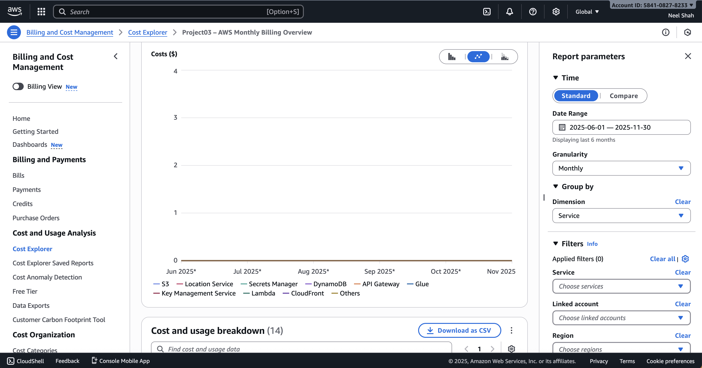
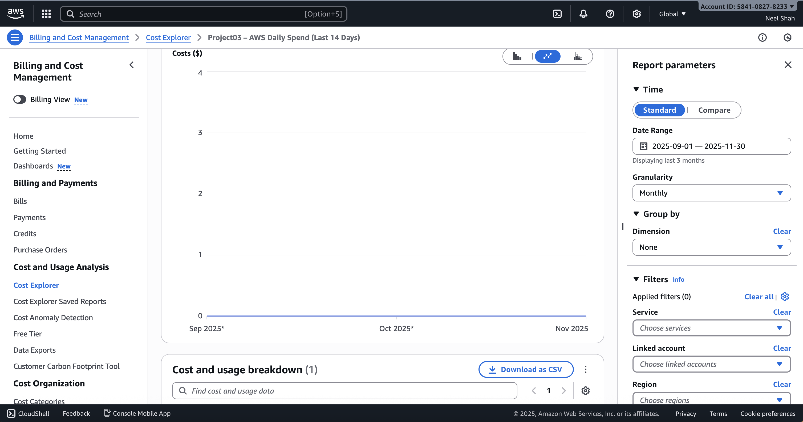
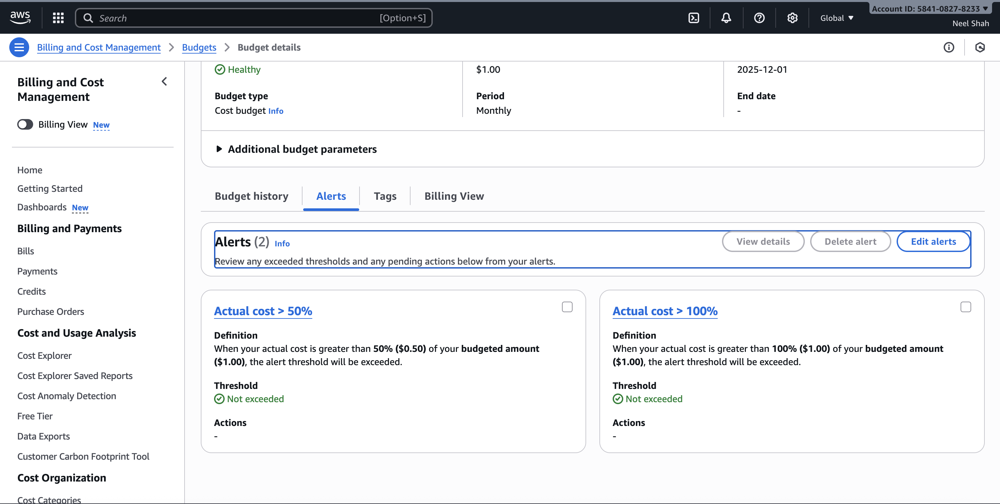

# 📊 Project 03 — AWS Billing Dashboard + Budget Alerts

*(AWS Cost Explorer + Budgets + Free Tier Monitoring)*

This project provides a clear, visual, and automated way to monitor AWS billing.It is part of my **Cloud Engineering & DevOps Portfolio**, demonstrating skills in:

- AWS Cost Management
- Budgeting & Alerting
- Usage Analytics
- Cloud Financial Operations (FinOps)

## 🌐 Live Billing Dashboards (Cost Explorer)

### **1️⃣ Monthly Billing Overview (Last 6 Months)**

A Cost Explorer dashboard showing monthly AWS spending trends, grouped by service.
This helps track spending patterns and understand which services generate costs.

### **2️⃣ Daily Spend — Last 14 Days**

A short-term cost analysis dashboard that shows daily usage patterns and identifies spikes quickly.

## 💰 AWS Budget + Alerts

A monthly AWS Budget was created with the following configuration:

- **Budget type:** Cost Budget
- **Amount:** User-defined spending threshold
- **Period:** Monthly
- **Alerts:**
  - 50% usage alert (email notification)
  - 100% usage alert (critical warning)

This ensures cloud costs never exceed target levels.

📸 *Screenshot inserted here in GitHub after upload*

## 🧰 Project Components

### **✔ AWS Cost Explorer**

- Built 2 interactive dashboards:
  - “AWS Monthly Billing Overview”
  - “AWS Daily Spend (Last 14 Days)”
- Grouped by: Service
- Granularity: Monthly & Daily

### **✔ AWS Budgets**

- Created custom cost budget
- Added email alert notifications
- Linked to AWS Billing monitoring

### **✔ Free Tier Usage Monitoring**

- Verified “Free Tier Usage” dashboard
- Confirmed services within free usage limits

## 🧩 Architecture Summary

User (Me)
↓
AWS Management Console
↓
Cost Explorer Dashboards → View spending insights
↓
AWS Budgets → Sends alert emails
↓
Free Tier Monitoring → Tracks usage limits

## Skills Demonstrated

- AWS Cost Explorer
- AWS Budgets & Alerts
- FinOps Basics (Cost Visibility & Control)
- Billing analysis
- Cloud cost optimization mindset
- Monitoring cloud consumption
