# Project 04 – EC2 Web Server in a Custom VPC (Nginx Hosting)

Part of **Neel Shah – Cloud Portfolio**

This project demonstrates how to host a simple website using **Amazon EC2**, **Nginx**, and a **custom VPC**.
Unlike Project 01 (S3 + CloudFront), this project uses the classic **VM + web server** pattern.

## 🎯 What This Project Shows

* Launching an **Amazon EC2 (t2.micro)** instance inside a **custom VPC**
* Configuring:
  * VPC (`10.0.0.0/16`)
  * Public subnet (`10.0.1.0/24`)
  * Route table with **Internet Gateway** for outbound internet
  * Security group allowing **HTTP (80)** and **HTTPS (443)**
* Using **AWS Systems Manager Session Manager** to connect (no SSH key needed)
* Installing and configuring **Nginx** on Amazon Linux 2
* Serving a static website from:
  <pre class="overflow-visible!" data-start="2901" data-end="2938">

<code class="whitespace-pre! language-bash">/usr/share/nginx/html
  </code>

</pre>
* Verifying that the site is reachable from the internet using the EC2 public IP

## 🛠️ Steps Performed

### 1️⃣ Custom VPC

* **CIDR:**`10.0.0.0/16`
* Tag: `Name: project04-vpc`

### 2️⃣ Public Subnet

* **CIDR:**`10.0.1.0/24`
* **AZ:**`ca-central-1a`
* **Auto-assign public IP:** Enabled
* Tag: `Name: project04-public-subnet`

### 3️⃣ Internet Gateway

* Created an **Internet Gateway**
* Attached it to `project04-vpc`
* Tag: `Name: project04-igw`

### 4️⃣ Route Table

* Created a **public route table**
* Added route:
  <pre class="overflow-visible!" data-start="3648" data-end="3729">

<code class="whitespace-pre! language-text">Destination: 0.0.0.0/0
  Target: Internet Gateway (project04-igw)
  </code>

</pre>
* Associated route table with **project04-public-subnet**
* Tag: `Name: project04-public-rtb`

### 5️⃣ Security Group

**Inbound rules:**

| Type  | Protocol | Port | Source    | Purpose            |
| ----- | -------- | ---- | --------- | ------------------ |
| HTTP  | TCP      | 80   | 0.0.0.0/0 | Public web traffic |
| HTTPS | TCP      | 443  | 0.0.0.0/0 | Future TLS support |

**Outbound:**

* Allow all (default)

Tag: `Name: project04-web-sg`

### 6️⃣ EC2 Instance (Amazon Linux 2)

* AMI: **Amazon Linux 2**
* Type: `t2.micro` (Free Tier)
* Subnet: `project04-public-subnet`
* Public IP: **Enabled**
* Security group: `project04-web-sg`
* IAM Role: **SSM-enabled EC2 role** (for Session Manager)

Tag: `Name: project04-web-ec2`

### 7️⃣ Connected via Systems Manager (No SSH Keys)

1. Go to **AWS Systems Manager → Session Manager**
2. Click **Start session**
3. Select `project04-web-ec2`
4. Open terminal in browser

You now have a shell into the EC2 instance without exposing port 22.

### 8️⃣ Installed Nginx

<pre class="overflow-visible!" data-start="4782" data-end="5074">

<code class="whitespace-pre! language-bash"># Update metadata about available extras
sudo amazon-linux-extras list

# Install nginx from Amazon Linux Extras
sudo amazon-linux-extras install nginx1 -y

# Start and enable nginx
sudo systemctl start nginx
sudo systemctl enable nginx

# Check status
sudo systemctl status nginx
</code>

</pre>

At this point, visiting:

<pre class="overflow-visible!" data-start="5102" data-end="5136">

<code class="whitespace-pre! language-text">http://<EC2-PUBLIC-IP>
</code>

</pre>

showed the default **“Welcome to nginx!”** page.

### 9️⃣ Deployed Custom Site

Copied your `index.html` into the Nginx web root:

<pre class="overflow-visible!" data-start="5274" data-end="5366">

<code class="whitespace-pre! language-bash">sudo mv index.html /usr/share/nginx/html/index.html
sudo systemctl restart nginx
</code>

</pre>

Now, hitting the EC2 public IP displays your custom site instead of the default Nginx page.

## 🌐 Public URL

* **Public IPv4 address**: Found in **EC2 → Instances → project04-web-ec2**
* Example:
  <pre class="overflow-visible!" data-start="5574" data-end="5605">

<code class="whitespace-pre! language-text">http://3.97.x.x
  </code>

</pre>

## 📦 Tech Stack

| Layer         | Service / Tool                                             |
| ------------- | ---------------------------------------------------------- |
| Compute       | Amazon EC2 (Amazon Linux 2, t2.micro)                      |
| Networking    | VPC, Public Subnet, Route Table, Internet Gateway          |
| Security      | Security Group (HTTP/HTTPS), IAM Role, SSM Session Manager |
| Web Server    | Nginx                                                      |
| Access Method | AWS Systems Manager Session Manager                        |

---

## 📘 What I Learned

* Designing a **public subnet** with proper routing to the internet
* How **VPC, subnet, route table, IGW, security group, EC2** all fit together
* Managing a Linux server:
  * Installing packages
  * Starting/stopping services
  * Replacing web content in `/usr/share/nginx/html`
* Using **Session Manager** as a more secure alternative to raw SSH
* Comparing architectures:
  * **Project 01**: S3 + CloudFront (fully managed, static hosting)
  * **Project 04**: EC2 + Nginx (more control, OS-level access)

## 🧠 Architecture Diagram

### Mermaid (for GitHub / modern viewers)

```mermaid


graph TD
  User[🌐 Browser] -->|HTTP/HTTPS| IGW[Internet Gateway]

  IGW --> RT[Route Table<br/>0.0.0.0/0 → IGW]
  RT --> Subnet[Public Subnet<br/>10.0.1.0/24]

  Subnet --> SG[Security Group<br/>Allow :80/:443]
  SG --> EC2[(EC2 Instance<br/>Nginx Web Server)]

  VPC[VPC 10.0.0.0/16] --- Subnet
  VPC --- IGW



```

