# Project 04 – EC2 Web Server in a Custom VPC (Nginx Hosting)

Part of **Neel Shah – Cloud Portfolio**

This project demonstrates how to host a simple website using **Amazon EC2**, **Nginx**, and a **custom VPC**.
Unlike Project 01 (S3 + CloudFront), this project uses the classic **VM + web server** pattern.

## 🧠 Architecture Diagram

### Mermaid (for GitHub / modern viewers)

```mermaid
graph TD
  User[🌐 Browser] -->|HTTP/HTTPS| IGW[Internet Gateway]

  IGW --> RT[Route Table<br/>0.0.0.0/0 → IGW]
  RT --> Subnet[Public Subnet<br/>10.0.1.0/24]

  Subnet --> SG[Security Group<br/>Allow :80/:443]
  SG --> EC2[(EC2 Instance<br/>Nginx Web Server)]

  VPC[VPC 10.0.0.0/16] --- Subnet
  VPC --- IGW
```

